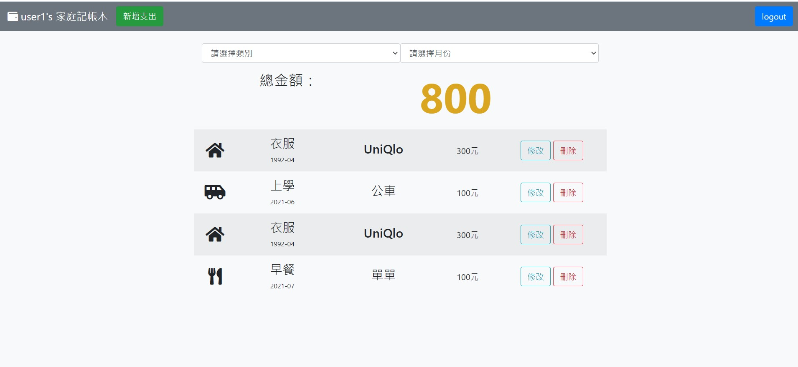
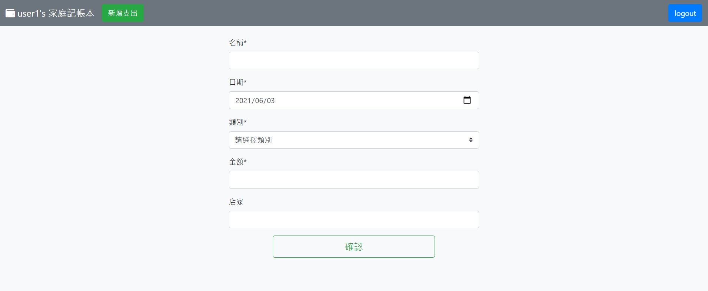
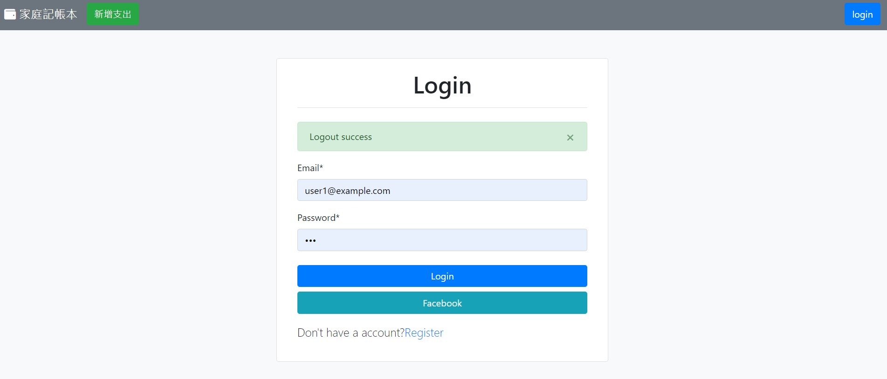
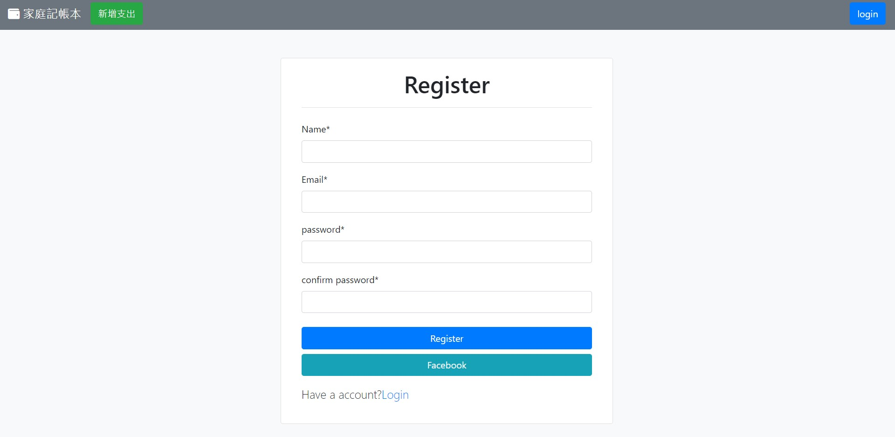

# 老爸私房錢
使用Express製作的記帳網路應用程式

## 首頁

## 新增頁

## 登入頁

## 註冊頁

## 功能
1. 使用者可以瀏覽所有消費
2. 使用者可以新增消費紀錄
3. 使用者可以修改消費紀錄
4. 使用者可以刪除消費紀錄
5. 使用者可以透過分類欄位瀏覽特定類別、特定月份的消費紀錄
6. 使用者可以註冊自己的帳戶並使用email及密碼登入
7. 使用者可以使用facebook登入
8. 使用者可以透過登入建立並管理屬於他的記帳列表
7. 自動加總當頁面消費的金額

## 環境與套件
* 環境：[Node.js](https://nodejs.org/en/)
* 框架：[Express](https://expressjs.com/)
* 樣板：[handlebars](https://www.npmjs.com/package/express-handlebars)
* 套件：[Bootstrap](https://getbootstrap.com/docs/4.6/getting-started/introduction/)
* 套件：[Popper.js](https://popper.js.org/)
* 套件：[Jquery.js(3.6.0.min)](https://jquery.com/)
* 套件：[mongoose](https://mongoosejs.com/)
* 套件：[bcrypt](https://www.npmjs.com/package/bcryptjs)
* 套件：[connect-flash](https://www.npmjs.com/package/connect-flash)
* 套件：[dotenv](https://www.npmjs.com/package/dotenv)
* 套件：[passport](https://www.npmjs.com/package/passport)
* 套件：[passport-local](https://www.npmjs.com/package/passport-local)
* 套件：[passport](https://www.npmjs.com/package/passport-facebook)
* 套件：[method-override](https://www.npmjs.com/package/method-override)
* 資料庫：[mongodb](https://www.mongodb.com/)

## 安裝與執行步驟
1. 使用終端機，clone此專案到local位置

        git clone https://github.com/tim80411/expense-tracker.git

2. 使用終端機，進入此專案所在的資料夾

        cd expense-tracker

3. 安裝套件

        npm install
4. 安裝mongodb並在mongodb內建立資料庫expense-tracker
5. 新增種子資料

        npm run seed

6. 啟動伺服器

        npm run dev
7. 在資料夾下建立.env檔案並參考.env.example檔案

8. 前往[Facebook](https://developers.facebook.com/)註冊應用程式並獲取passport-facebook需要的 FACEBOOK_APP_ID&FACEBOOK_APP_SECRET

9. 看到以下字樣代表成功啟動並監聽server以及成功連上資料庫

        Express server is running on https://localhost:3000
        mongodb connect success!

        
在任一瀏覽器輸入localhost:3000即可進入網站
